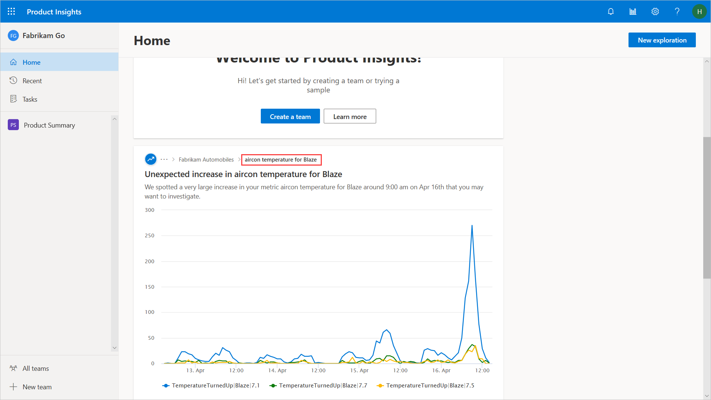
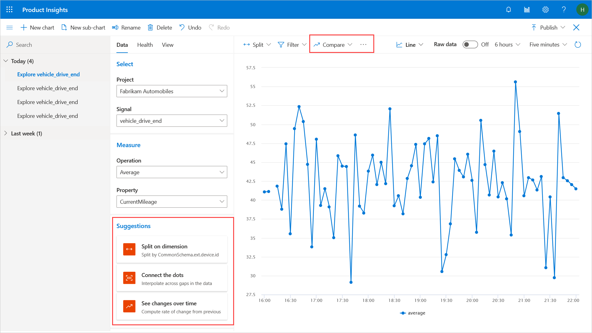

# Get insights

Product Insights helps you discover insights in data with which you may not be familiar. There are two main ways Product Insights provides additional insight. One is on your home page when you log in. Our AI-powered engine picks up any interesting patterns or anomalies in your data, and displays on your home screen. When you are exploring data, you will see suggested splits and transforms you can perform on your data for insights. 

1. Log in. If signals are already flowing into your project, you will see notifications on your home page. Click to further explore the data. 

2. Select a signal and click **Explore** (follow [this section](1_view-signals) to find out how). 
3. [Create a metric](2_create-own-metric). See suggestions appear below the property dropdown. 
4. There are also a suite of transforms available. You can smooth spiky data, run comparisons to past data, and fix data gaps. 

