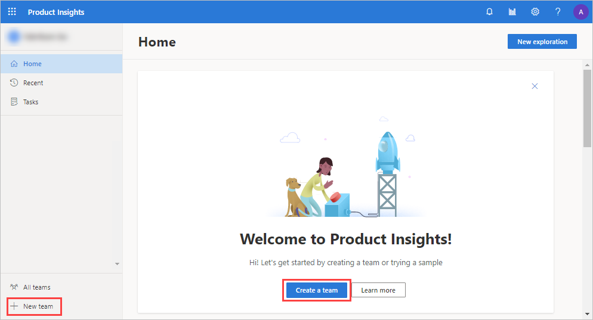

# Quickstart: Setup to Insights in five minutes 

This quickstart shows you how get started with the Product Insights portal in five minutes by signing up, creating a sample organization and a team, adding members to the team, creating sample signals, viewing the generated signals, and setting up dashboards for charts. 

## Product Insights overview

> [!VIDEO https://www.microsoft.com/en-us/videoplayer/embed/RE2RZnI]

## Sign up for a Product Insights preview
Sign into Product Insights at [https://pi.dynamics.com](https://pi.dynamics.com) in a web browser. You may need to log in via an incognito window in your browser (Ctrl+Shift+N).
> [!NOTE]
> - An AAD (Azure Active Directory) account is required for the Product Insights preview. Contact [Jeff Hardie](email:jefhar@microsoft.com) to enable a preview for your AAD.
> - The Product Insights team may also provide a sample AAD account. Contact [Jeff Hardie](email:jefhar@microsoft.com) to request yours.
> - Previews are not available to MSA accounts (example: [sample@outlook.com](email:sample@outlook.com)) at this time.

## Create a team
1. Select **Create a team** in the center welcome tile, or **+New team** in the bottom left corner of the portal.
1. Type *Test_Team* in the **Name** field and anything for **Description**. Select **Create** to commit the update.

	
  
## Add members
1. Select *Test_Team* from the left menu.  
1. In the center pane, select **Members** and then **+Add Members**
1. Enter email addresses from your AAD for any new members you would like to have access, and then select **Role** under **Owner**. Select **Add** to commit the update.

	

## Create a project 
1. In the center pane, select **Projects** and then **+New project**.
1. Type *SampleProject* and any other text for **Description**.  Select **Create** to commit the update.

	
  
## Create data
Using this tool, you can create a new signal for the sample project by defining a schema of the signal. 

### Define signal 
1. Select *sampleproject* from the center pane. 
1. Select **+Define a Signal**, and then type `SampleSignal` and any other text for **Description**.  Select **Add** to commit the update.  You will define the various properties in the next steps.
1. Select *SampleSignal*, and then select **+Add** for each of the following properties:

|Display name | Expected type|
|-------------|--------------|
|command|String| 
|speed|Number  |
|model|String  |

1. Select **Save** on the top right of the toolbar.

### Generate data 
1. Select **Generate** on the top right of the toolbar, and then select **+Add** for each of the following properties:
1. Select **Start** to begin generating data.

|Property|Example value|Variation range|
|--------|-------------|---------------|
|command|start,stop|
|speed|100|40%|
|model|mazda, acura, bmw|

   

## Preview signals
1. Select **Explore** on the top right of the toolbar.  You will see the sample data that was generated for the properties you provided. 
1. Toggle **Raw data** to view the data as a chart.  You can begin exploring the data at this point. 

   
 
## Publish your metric to dashboard
1. Select **Publish to new dashboard** on the top right of the toolbar. Leave the default name, and select **Publish** to commit the update.

> [!div class="nextstepaction"]
> [Next >>](who-uses.md)

