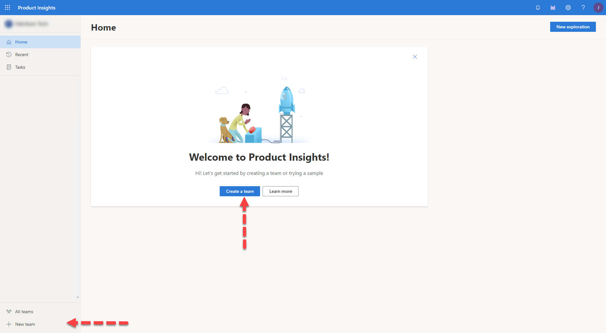
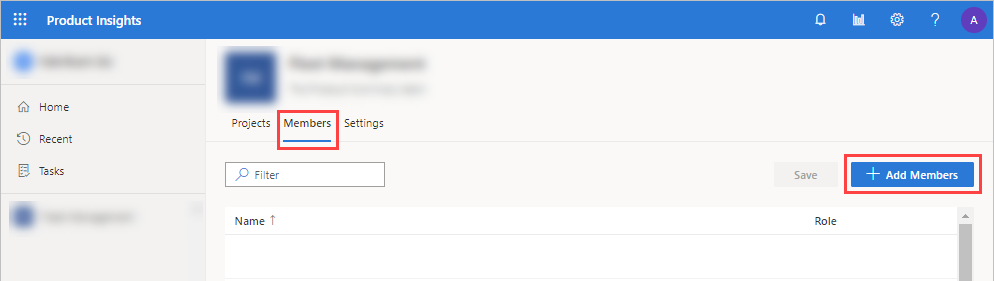
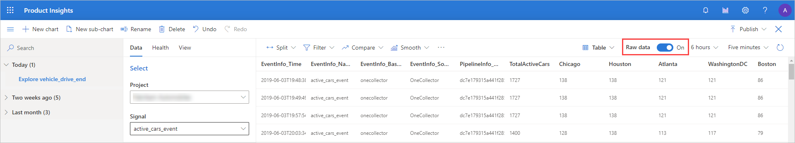

# Quickstart: Setup to Insights in 5 minutes 

This quickstart shows you how to use the Product Insights portal to find actionable insights in 5 minutes. 

## Product Insights overview

> [!VIDEO https://www.microsoft.com/en-us/videoplayer/embed/RE2RZnI]

## Sign up for Product Insights preview
Sign in to Product Insights at https://pi.dynamics.com in a web browser. You may need to login via a incognito window in your browser (Ctrl+Shirt+N).
> [!NOTE]
> - AAD (Azure Active Directory) account is required for Product Insights preview, contact XXX to enable preview for your AAD.
> - Product Insights team may also provide a sample AAD account, contact XXX to request yours.
> - Preview is not avalible to MSA accounts (i.e. sample@outlook.com) at this time.  

## Create Team
1. Select **Create a team** in the center welcome tile, or **+New team** in bottom left-hand corner of the portal.
1. Type *Test_Team* for the **Name** and anything for **Description**. Click **Create** to commit update.

	
  
## Add Members
1. Select *Test_Team* from the left menu.  
1. In the center pane, click **Members**, click **+Add Members**
1. Enter emails from your AAD for any new members you would like to grant access, select **Role** of *Owner*. Click **Add** to commit update.

	

## Create Project 
1. In the center pane, select **Projects**, click **+New project**
1. Type *SampleProject* and anything for **Description**.  Click **Create** to commit update.

	
  
## Create Data
1. Click *sampleproject* from center pane. 
1. Click **+Define a Signal**, type *SampleSignal* and anything for **Description**.  Click **Add** to commit update.  You will define the variuos properties in next steps.
1. Click *SampleSignal*, click **+Add** for each of the following properties:

|Display name | Expected type|
|-------------|--------------|
|command|String| 
|speed|Number  |
|model|String  |

1. Click **Save** in top right in the tool bar
1. Click **Generate** in top right in the tool bar, click **+Add** for each of the following properties:
1. Click **Start** to begin generating data.

|Property|Example value|Variation range|
|--------|-------------|---------------|
|command|start,stop|
|speed|100|40%|
|model|mazda, acura, bmw|

   

## Preview signals
1. Click **Explore** in top right in the tool bar.  You will see the "fake" data that is generated for the properties you provided. 
1. Toggle **Raw data** to view the data as a visual chart.  You can begin exploring the data at this point. 

   
 
## Create Dashboard
1. Click **Publish to new dashboard** in top right in the tool bar. Leave the default name, click **Publish** to commit update. 

  

> [!div class="nextstepaction"]
> [Next >>](who-uses.md)

