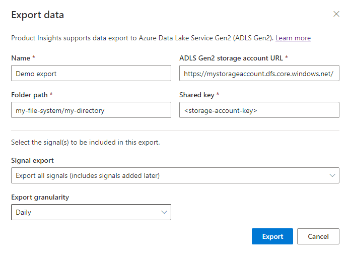

# Export your signals to Azure Data Lake Storage Gen2

## Overview
Product Insights signals export feature allows you to send the data that is generated by your devices/services to your Azure Data Lake Gen2 storage (ADLS). Data will be continuously written to ADLS accounts in near real-time.

Your signals will be available to you in format that is easy to consume, allowing you to perform advanced data analysis and other processing on raw data that was sent to Product Insights.

Azure Data Lake Storage offers a wide variety of available integrations. You can learn more about ADLS Gen2 [here](https://docs.microsoft.com/azure/storage/blobs/data-lake-storage-introduction).

## How to set up the signals export  

1. Create an ADLS Gen2 storage account. You can skip this step if you already own an account. [Here](https://docs.microsoft.com/azure/storage/blobs/data-lake-storage-quickstart-create-account) is a guide describing how to create an account.

2. Copy the **Azure Data Lake Storage URI** and **shared key** from the Azure Portal, as these will be needed in the next step.
    * Storage URI can be obtained after visiting the **Properties** pane of the storage account under the **Data Lake Storage** section.  
    * Storage account shared key can be obtained after checking the **Access keys** pane of the storage account.

3. Visit the management pane of your Product Insights project and create a new export.

## Export configuration  
This section contains a brief description of all available configuration options that are needed to configure this feature.

### Destination  
This section allows you to specify the authentication and export destination settings. These include:  

* ADLS Gen2 account URI, which should have the following format:
*https://<storage_account_name>.dfs.core.windows.net/*

* Storage account shared key

* File system and path. It describes where the export files should be stored inside the file system and directory structure of the storage account. Each ADLS Gen 2 account may contain multiple file systems. Each file system has its own directory structure. If specified file system and/or directories do not exist, they will be created. Below is a sample value for this field:  
*myfilesystem/directory1/directory2/*  

You need to specify at least the name of the file system.

### Options  
There are two settings to consider when exporting your signals:

#### Export granularity
This setting allows you to choose the granularity of files containing exported signals. Depending on this setting, your signals will be exported to files that are created per hour or per day.

#### Signals to be exported
This option allows you to choose which signals should be exported. You can either choose all signals or simply list the names of desired signals.

## Data format of exported signals
Signals will be exported using line delimited JSON format. Find out more about it [here](https://en.wikipedia.org/wiki/JSON_streaming#Line-delimited_JSON). This means that every line in the output file will contain a JSON object with all the properties that were sent in a single signal. Directory structure and file names will be created using current UTC time of servers exporting the data.
