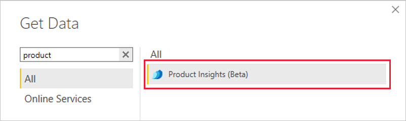
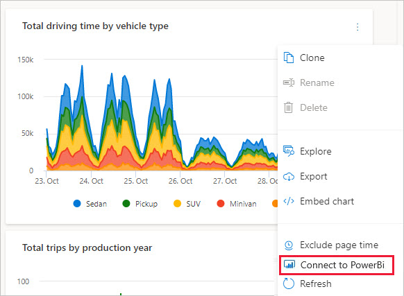
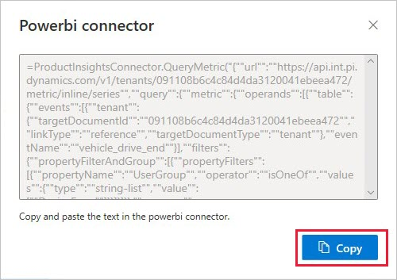

# Product Insights Power BI Connector

The Power BI connector accesses aggregated signal data (metrics) from Product Insights, making it possible to construct Power BI reports and dashboards from Product Insights data.  

You can access Product Insights data through the PowerBI Connector in two ways:  

1. Through the PowerBI Desktop navigation table.  
2. Through copy/paste from the Product Insights user interface (UI).

## Connect using the navigation table
By connecting through the PowerBI Desktop navigation table, the data for a selected chart will be brought into PowerBI from Product Insights. Currently, the interval and granularity of the data will adhere to the settings in the Product Insights UI.

1. From PowerBI Desktop, select **Get Data** ->**More...**.

2. Select **Product Insights (Beta)** connector.  

3. Click **Connect**.

4. Sign in with your Microsoft account.  

5. Navigate through your project's dashboards to find the chart data you would like to import.  

6. Check the box next to your chart data and click **Load** to load the data into PowerBI. Once the data is loaded, it will appear in the **data** tab, as shown in the screenshot below.  

7. Now the data is available for creating visualizations, reports, and dashboards.  

	

## Connect through Product Insights UI

This mode of connecting involves copying a query directly from the UI and pasting it into the PowerBI query editor. Follow these steps:

1. Navigate to the dashboard which contains the chart data you would like to load.

2. Click the "..." at the right side of the chart header to show the **Connect to PowerBI** option.  

3. Copy the query to your clipboard.  
  

4. Launch PowerBI Desktop.

5. Select **Get Data** -> **Blank Query** to launch the query editor.

6. Paste the copied query from the UI into the query editor and press enter.  

