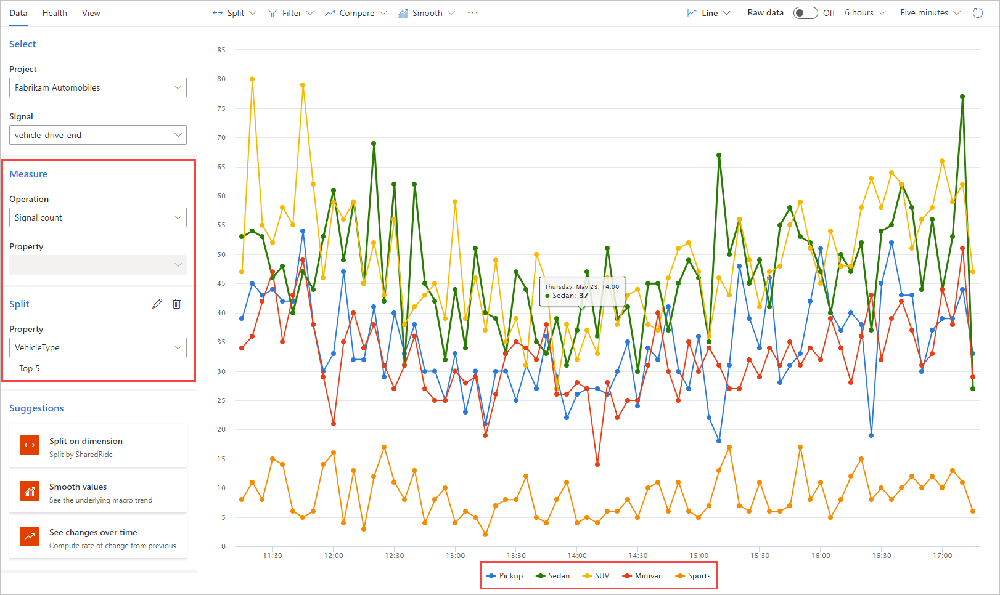
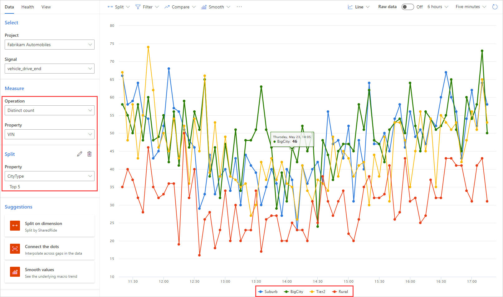
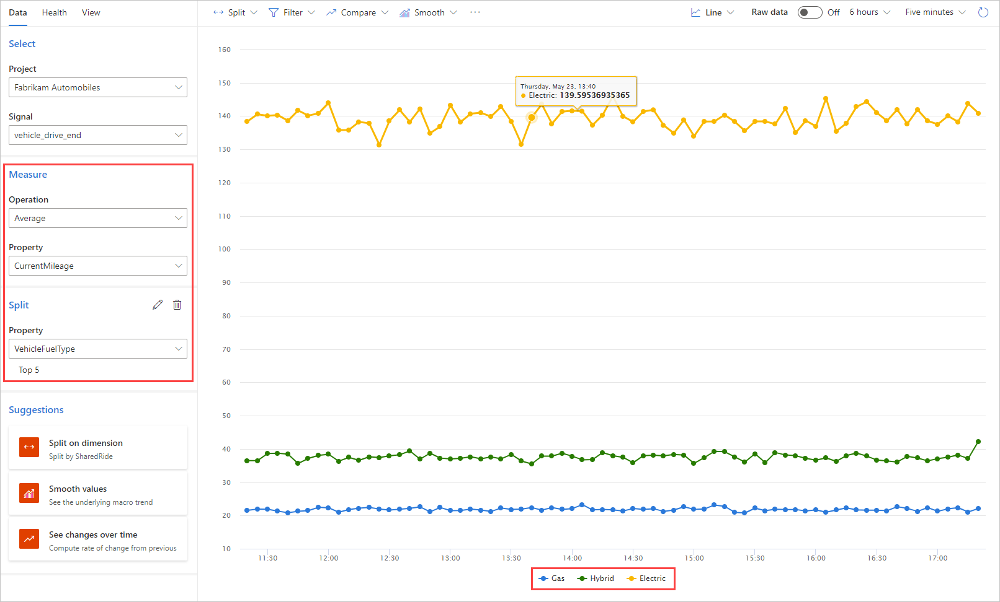

# Add splits to your metric 

Splitting a metric enables breaking it down into reported categories. For example, you can add the following split operations to [the metrics previously established](metrics-create-metrics): 

- Add a split to the "total number of drives completed metric" by selecting **Split** and then **VehicleType**. Now you can see the total number of drives for every vehicle type such as SUV, Sports, Minivan, and Sedan. 

    

- Add a split to the "distinct count of VINs" metric by selecting **Split** and then **CityType**. Now you can see the total number of unique vehicles reporting in, divided into the types of their locations. 

    

- Add a split to the average MPGe metric by selecting **VehicleFuelType**. Now you can see average MPGe values for gas, electric, and hybrid vehicles.

    
