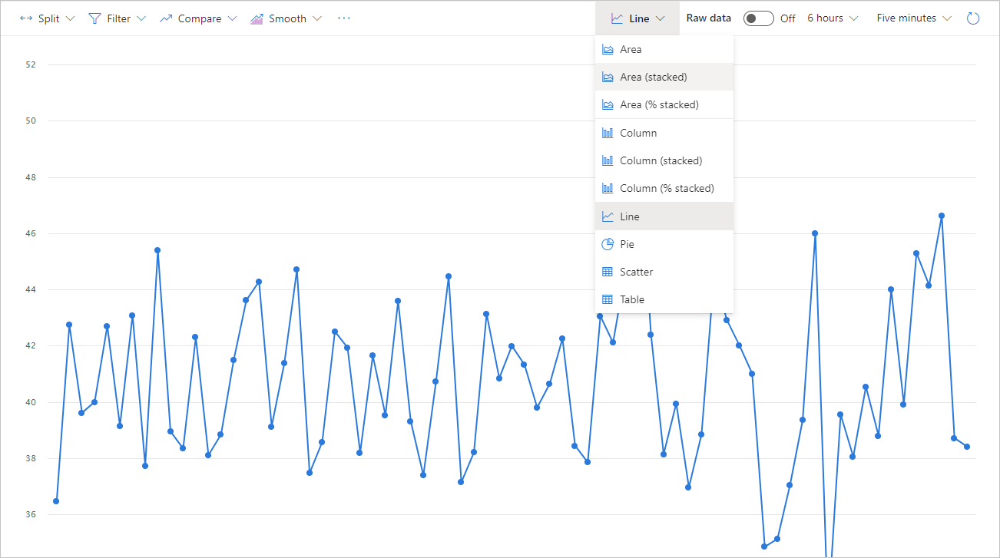
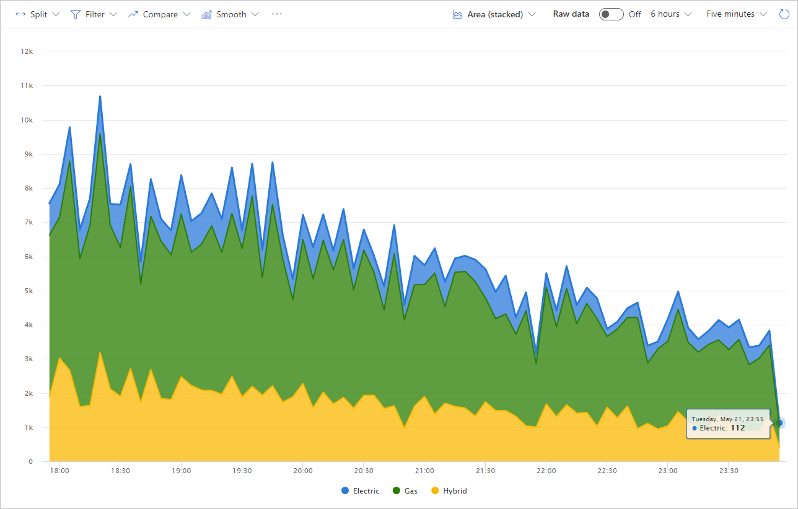
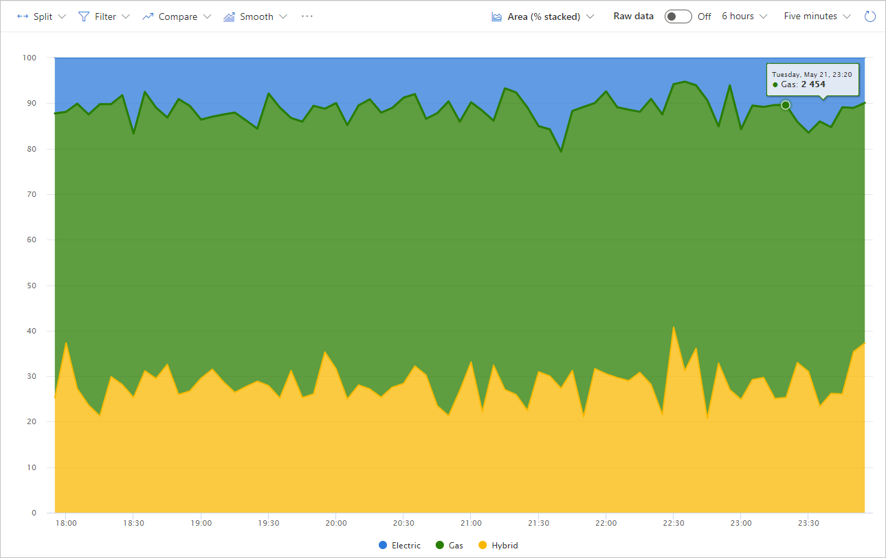
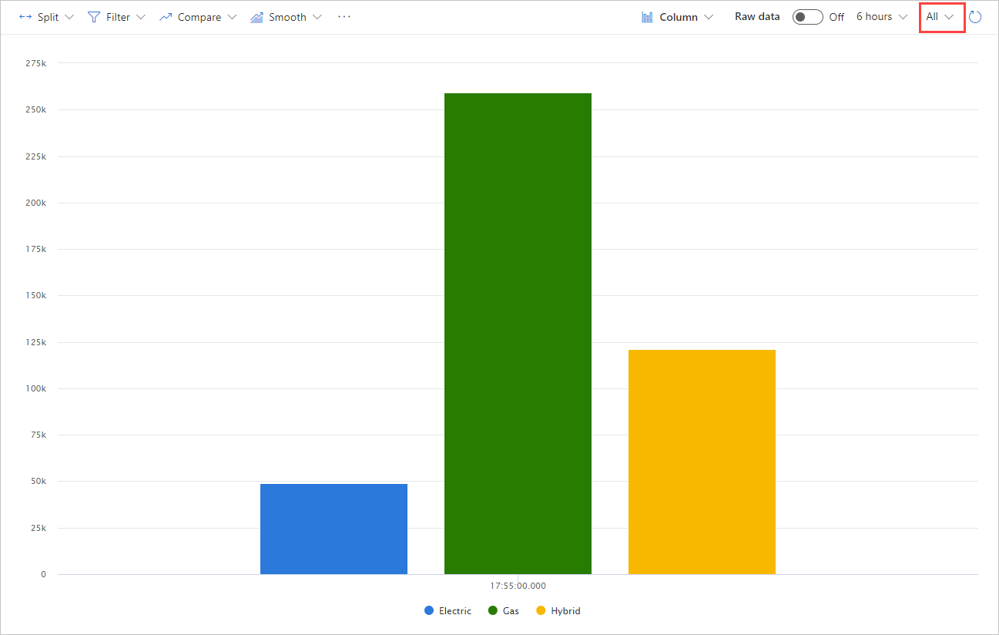
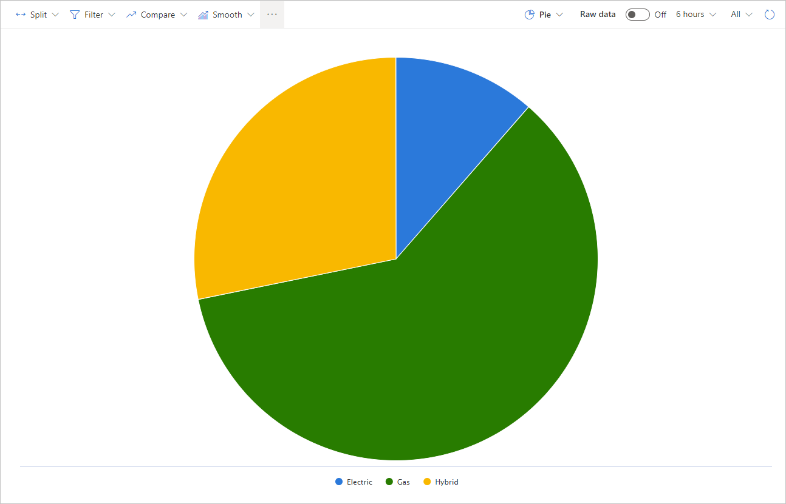
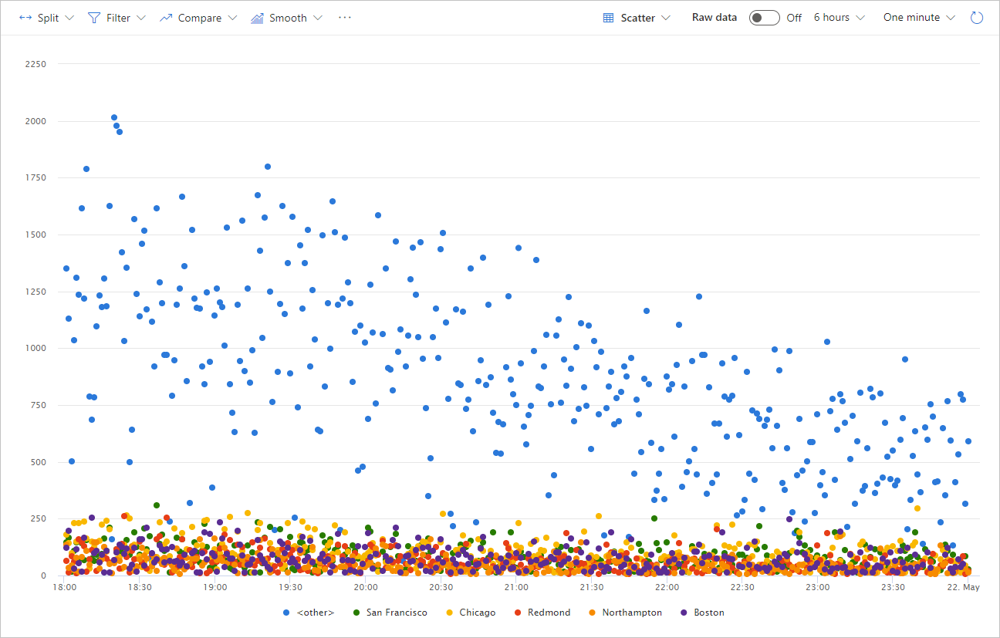
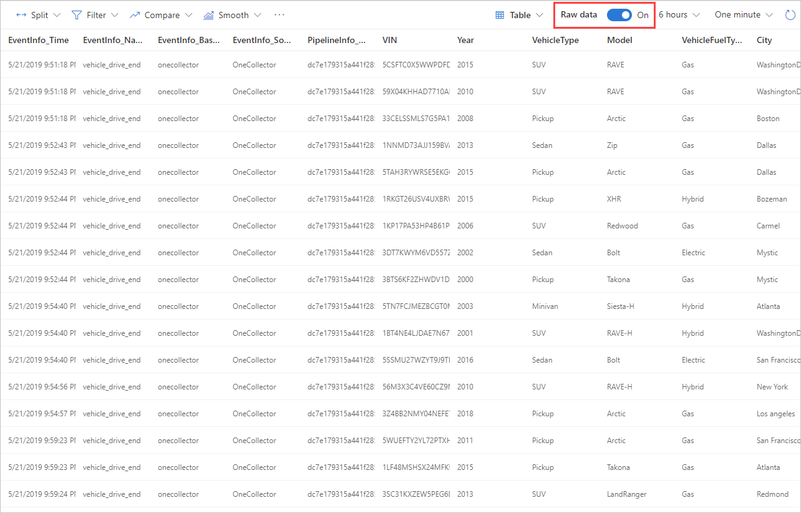

# Choose visualizations  

Product Insights has many visualization options. By default, data will be displayed in a table. A row represents a single signal. When the Raw data option is turned off, a line chart is typically displayed. 

* Line

See values change over time. Simplest option.

* Area - 
Stacked: vehicle_drive_end, Sum operation, CurrentTripDistance

Then add a split on VehicleFuelType 

Switch to %stacked to what percentage of trips each fuel type is. 

Good to see how much each segment takes is over time. 

* Column 

Bar charts. To see total breakdown, switch to "all"  

(Continuing from previous example), switch to Column, then change "Five minutes" to All  

Then switch granularity to "hour"  

* Pie 

Removes time as a dimension. Good to see distribution.

* Scatter 

Does not force a trend. Good for a general picture. 

* Table 

Good for seeing raw data. 

