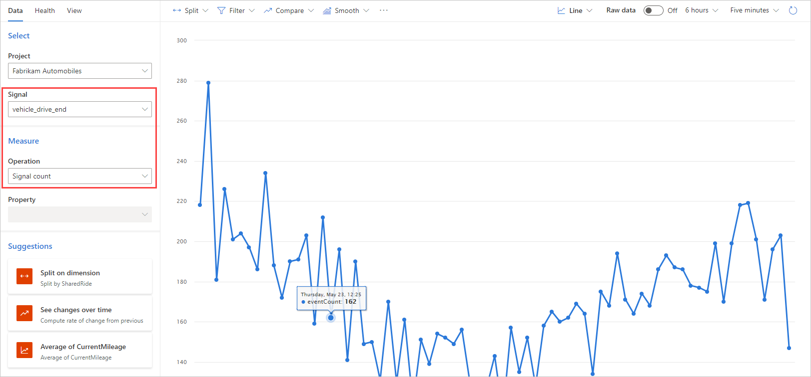
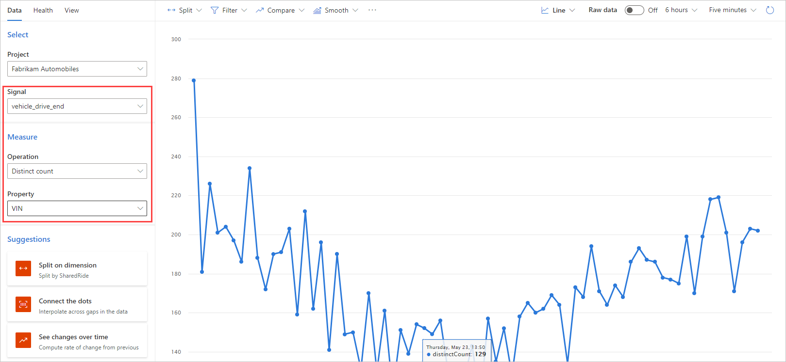
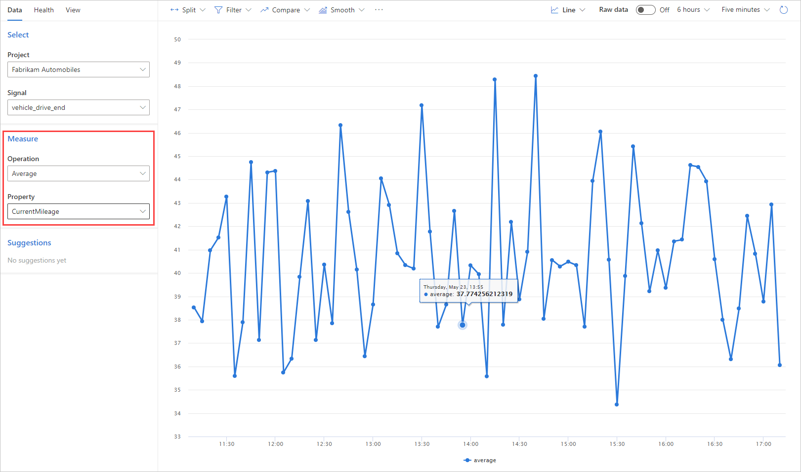

# Create metrics 

You can create metrics based on the signals you are receiving. Select a signal from one of your projects, then click **Explore** to create your metrics. 

In the [sample project](https://pi.dynamics.com/teams/fe359446d26a4e4eb094e9c5fbe89f21/projects/dc7e179315a441f285d5fe77993bd72c/signals), select the **vehicle_drive_end** signal. You should see a list of signals being received. Select **Explore** in the top right corner of the screen.

Here are some sample metrics you can create based on the signal you have selected:

- Total number of drives completed. To create this metric, simply select **Signal count** operation. 

    

- To see the total number of unique cars, select **distinct count**, and then select the **VIN** property. This will give you a distinct count of vehicle identification numbers presented in the incoming **vehicle_drive_end** signals. 

    

- To see average MPGe for all completed drives, select the **average** operation, then choose the **CurrentMileage** property, which represents MPGe value for completed drives. Product Insights collects all **CurrentMileage** data reported, and then calculates the average value. 

    

For further instructions, see below. 

1. To create a metric, first verify that the **Project** and the **Signal** are correct. 
1. Decide which operation to use. Do you simply want a count of signals sent? Do you want an average of some numeric value such as MPGe? 
1. If you want an average, specify which property to use. For this example, use the **CurrentMileage** property.

