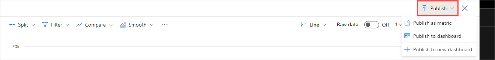

# Publish metrics

Once you have a metric that contains information you want to track, you can **Publish as metric** or **Publish to dashboard**. The first option saves the metric to the project to be tracked continuously. The second option adds your chart to the dashboard of your choice.

