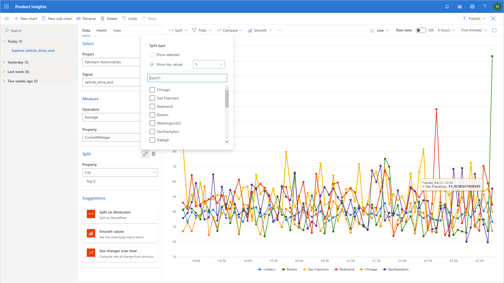

# Select top N 

When you add a split to a metric, Product Insights automatically selects the top five values. For example, if you wanted to see the total number of drives per city, when you add **City** as a split, you will see the top five cities, with the rest grouped into **\<other\>**.

