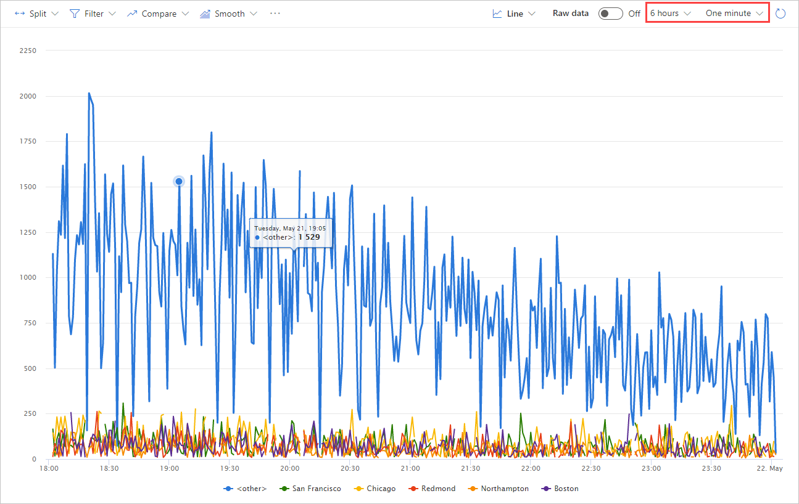
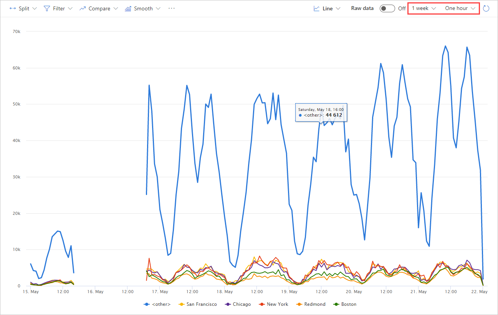

# Set granularity 

Data on a chart is usually bound by time. For example, if you request the last 24 hours of data, grouped by hour, you will see 24 values graphed on a chart. 

You can change the date range and granularity. Granularity specifies how to group data. If you use a granularity of five minutes,  the data will be more detailed. If you use hourly or daily granularity, it will be easier to see trends, but you will probably lose details. 

Depending on your time range, granularity might chosen for you automatically for performance's sake. For example, if you want last week's data, default granularity is one hour and smaller granularities such as one and five minutes may be unavailable. 

