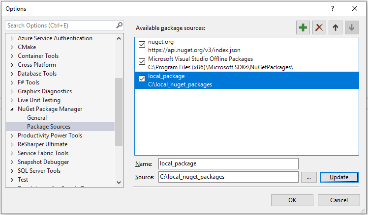

# Run Product Insights .NET SDK Sample
## Prerequisites
- Visual Studio
- .NET Core 1.0+
- Ingestion Key (See [here](dotnet.md) for instructions on how to obtain)

## Run Sample
1. [Download](https://download.pi.dynamics.com/sdk/ProductInsightsSamples/pi_csharp_sample.zip) the **Product Insights .NET SDK sample**.
2. Unzip the compressed file `pi_csharp_sample.zip`.
3. Open Visual Studio.
4. On the menu, choose **File > Open... > Project/Solution...**
5. Choose `PICSharpSample.sln` from the decompressed **pi-csharp-sample** project
6. Import the Product Insights SDK:
    1. [Download](https://download.pi.dynamics.com/sdk/ProductInsightsSenders/pi_csharp_sdk.zip) the **Product Insights .NET SDK**
	2. Unzip the compressed file **pi_csharp_sdk.zip** to a local folder.
	3. Go to your project in Visual Studio, and add a new **Nuget Package Source** to the local folder where you put the SDK.
		1. On the **Tools** menu, select **Options**.
		2. Expand **NuGet Package Manager** and select **Package Sources**.
		3. Select the green plus in the upper right corner.
		4. At the bottom of the dialog box, enter the feed's name and the local folder path where you put the .NET SDK package.
		5. Select **Update**.
		6. Select **OK**.

		
7. Open **Program.cs** file in project
8. Replace *{YOUR_INGESTION_KEY}* with the ingestion key you have created on Product Insights portal
9. On the menu, choose **Build > Build Solution** to build the entire solution
10. On the menu, choose **Debug > Start Debugging** to run the sample
11. Wait a few minutes and you should now be able to see signals under your project on the Product Insights portal
