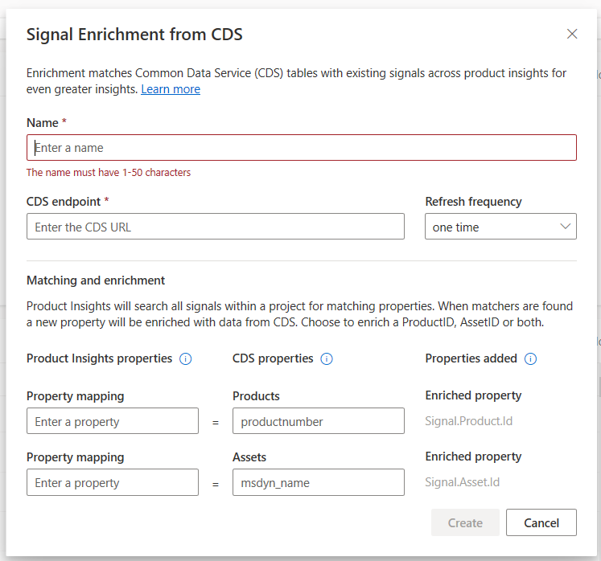

# Getting Started with the Product Insights CDS Enrichment

This tutorial will guide you through the process of using a Product Insights Common Data Service (CDS) enrichment capability, which will allow you to enrich the real-time signals from sources like IoT with additional fields that are sourced from CDS.

The data ingested is limited to just two fields from CDS: `ProductId` from product entity and `AssetId` from asset entity.

> [!NOTE]
> Enrichment is limited to one per project, and this feature is not available for Microsoft account users (MSA accounts). The maximum supported enrichment size is 10MB and the generated enrichment rule will be in effect after 15 minutes for the new signals.

## Prerequisites
* Dynamics Field service subscription
  * To obtain free trial subscription:
    1. Sign up at [Microsoft Dynamics 365](https://trials.dynamics.com).
    2. Join an existing trial or create a new tenant.
    3. To view the environment, go to `https://<tenant_name>.crm.dynamics.com`

## Configuring CDS Enrichment
1. Select your project.
2. Select **Settings** under your project.
3. Scroll to **Enrichment Sources**.

4. Select **Add**. The **Signal Enrichment from CDS** screen appears.

5. Enter the name for CDS enrichment.
6. Enter CDS endpoint URL (`https://<tenant_name>.api.crm.dynamics.com`) and replace `<tenant_name>` with field service tenant name.
7. Select the CDS enrichment refresh frequency.
8. Enter the CDS products entity enrichment:
    * Enter the signal property name.
    * Enter the Products entity property name that matches the signal property name.
        * When the value of the signal property and product property matches, the `Signal.Product.Id` will be enriched with real-time signal.
        * To view the available products from CDS, follow these steps:
            1. Log onto Field Service (`https://<tenant_name>.crm.dynamis.com`)
            2. Open new tab and launch `https://<tenant_name>.crm.dynamics.com/api/data/v9.0/products`

9. Enter the optional CDS Asset(`msdyn_customerassets`) entity enrichment.
    * Enter the asset entity property name that matches the signal property name.
        * When the value of signal property and asset property matches, the `Signal.Asset.Id` will be enriched with real-time signal.
        * To view the available products from CDS, follow these steps:
            1. Log onto Field Service (`https://<tenant_name>.crm.dynamis.com`)
            2. Open new tab and launch `https://<tenant_name>.crm.dynamics.com/api/data/v9.0/msdyn_customerassets`

10. Select **Create**.

Based on the user token, the CDS enrichment will be scheduled.
