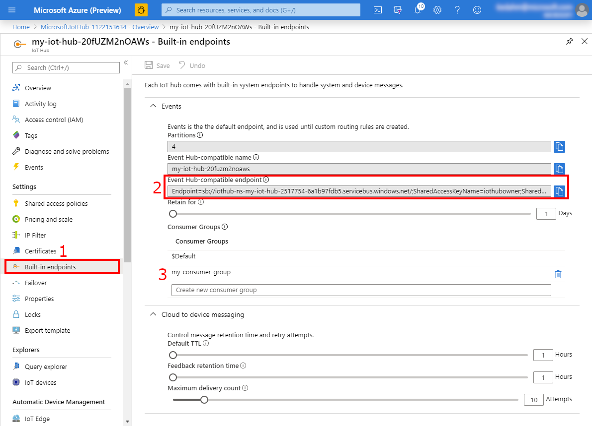
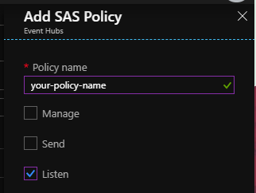
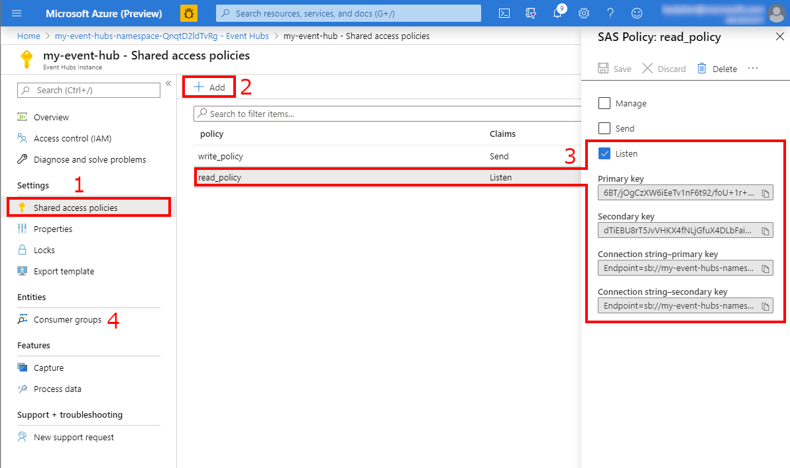

# Connecting Event Hubs to Product Insights

[!INCLUDE [cc-beta-prerelease-disclaimer]( includes/cc-beta-prerelease-disclaimer.md)]

Connect an Event Hub or IoT Hub to Product Insights to backfill existing data into your Product Insights project. Follow these steps to create your connection:

1. Obtain the **connection string** for your Event Hub or IoT Hub.
   * Optionally, though highly recommended, create a **consumer group** for Product Insights to read from as well.
2. Access your Product Insights project's **Settings** screen.
3. Add a data source with your **connection string**, optionally using your **consumer group**.

## Obtaining your Connection String

This step differs depending on whether you're connecting to an Event Hub or an IoT Hub; instructions for both are shown below. Your connection string should look like this:

```
Endpoint=sb://your-endpoint.servicebus.windows.net/;SharedAccessKeyName=key-name;SharedAccessKey=your-access-key;EntityPath=your-entity-path
```

### Obtaining an IoT Hub Connection String

1. On your IoT Hub's page in the [Azure Portal](https://portal.azure.com/), select **Built-in endpoints** on the left pane, under **Settings**.
2. Select and copy the contents of the **Event Hub-compatible endpoint** field.
3. (Recommended) Use the **my-consumer-group** field to create a new consumer group.



### Obtaining an Event Hub Connection String

These instructions assume you have already created an event hub instance inside your Event Hubs Namespace.

1. On your Event Hub's page in the [Azure Portal](https://portal.azure.com/), select **Shared access policies** on the left pane, under **Settings**.

   Note that you must be on the **Shared access policies** page for an Event Hub, not an Event Hub Namespace. If you only have an Event Hub Namespace, you must first create an Event Hub within that Namespace.

2. If you haven't created any access policies yet, select **Add** to add a policy. Make sure it has **Listen** permission.

   

3. Select the access policy you want to use and copy the **Connection string** (primary or secondary key).

   If you don't see an `EntityPath=...` section at the end of the connection string, you have created a connection string for an Event Hub Namespace, not an Event Hub.

4. (Recommended) Use the **Consumer groups** page to create a new consumer group.



## Making an Event Hub / IoT Hub Connection

Once you have your **connection string** (and optionally, your **consumer group**), open your project on [pi.dynamics.com](https://pi.dynamics.com/) to set up the connection. Once you make a connection, your project will be backfilled with any data in the hub, depending on its retention settings. Any future events pushed to the hub will also be sent to Product Insights.

1. Go to the **Settings** page.
2. Scroll down to **Data Sources** and select **+ Add**.
3. Enter your connection's **Name**, the **Azure IoT Hub Connection String**, and optionally a **Consumer group name**.
4. Select the **Connect** button to create the connection.


