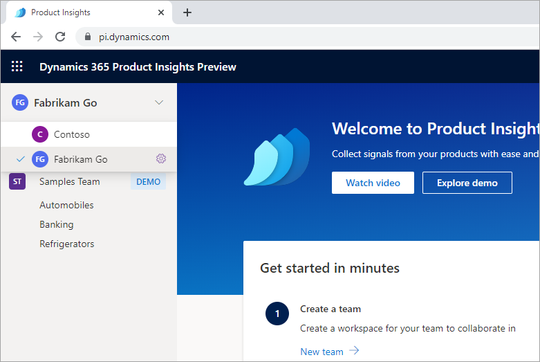
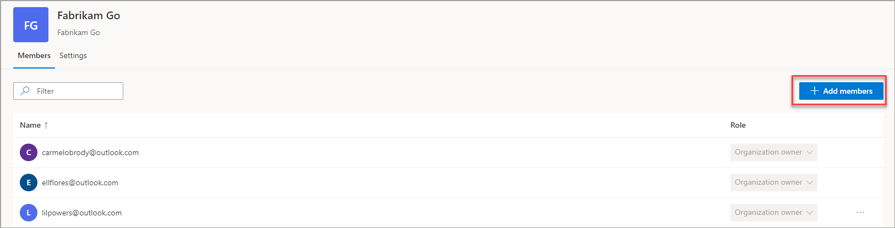
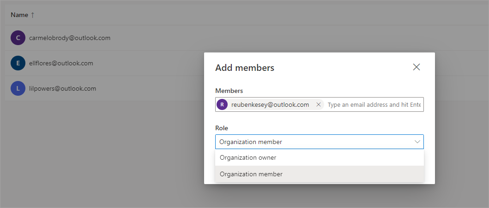
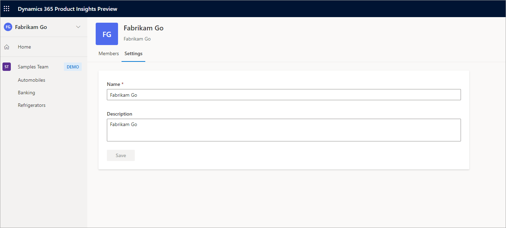

# How to administer an organization using a Microsoft account
[!INCLUDE [cc-beta-prerelease-disclaimer]( includes/cc-beta-prerelease-disclaimer.md)]

A Microsoft Service Account (MSA) user can have access to multiple organizations in Product Insights. Users can switch organizations by clicking on the **Organization Switcher** component on the home page. The organization switcher will list all organizations users as either owners or members. 

Click on **Settings** (the gear icon) to load the organization administration page.

Organization owners can do the following tasks:
-	Delete an existing member from the organization
-	Add new members to the organization
-	Update the name and description of an organization

## Deleting existing members
Organization owners can delete existing members by clicking on the delete button on the organization members page. 

The following restrictions hold when deleting a user who is an existing member of an organization:
-	The user cannot delete himself or herself.
-	The user cannot delete the individual who created the organization.

## Adding new members

To add new members, organization owners can click on the **Add members** button, enter an MSA email address and then add the new member.

One of the two roles below could be chosen when adding new members:
-	**Organization owner** – This role will have admin rights to the organization, which include: the ability to update the organization, and to add and delete members. Organization owners are automatically added to new teams.

-	**Organization member** – This role will have read-only rights to the organization. Members must be explicitly added to new teams. 

## Updating the name and description of an organization
Organization owners can update the name and the description of the organization from the settings tab. 

